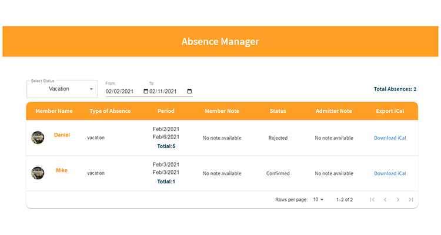

<div align="center">
  <h3 align="center">Crewmeister Front-end Challenge</h3>
</div>

<!-- TABLE OF CONTENTS -->
<details>
  <summary>Table of Contents</summary>
  <ol>
    <li>
      <a href="#about-the-project">About The Project</a>
      <ul>
        <li><a href="#built-with">Built With</a></li>
      </ul>
    </li>
    <li>
      <a href="#getting-started">Getting Started</a>
      <ul>
        <li><a href="#prerequisites">Prerequisites</a></li>
        <li><a href="#installation">Installation</a></li>
      </ul>
    </li>
    <li><a href="#usage">Usage</a></li>
    <li><a href="#assignement">Assignement</a></li>
    <li><a href="#contact">Contact</a></li>
  </ol>
</details>
<br />
<br />

<!-- ABOUT THE PROJECT -->

## About The Project

<div align="center">
  
</div>

<p>The Absence Manager project allows the HR to show the absentees, the total number for each type of absence, the duration's leave, the starting & the ending date, the name of each employee & their images. Moreover, the HR can export the information as an iCal file.
</p>
<br />

### Built With

This project is built using the following libraries

- [![React][react.js]][react-url]
- [![Node][node.js]][node-url]
- [![Material-ui][material-ui]][material-ui-url]

<!-- GETTING STARTED -->

## Getting Started

### Prerequisites

You need first to install the node to be able to run this project.

- npm
  ```sh
  npm install npm@latest -g
  ```

### Installation

1. Clone the repo
   ```sh
   git clone https://github.com/HasanMoussawi/Absence-Manager.git
   ```
2. Change the directory to open api folder
   ```sh
   cd api
   ```
3. Install NPM packages
   ```sh
   npm install
   ```
4. To run the server
   ```sh
   npm start
   ```
5. Open new terminal and change the directory to the client folder
   ```sh
   cd client
   ```
6. Install NPM packages
   ```sh
   npm install
   ```
7. To run the app
   ```sh
   npm start
   ```
8. To run the tests
   ```sh
   npm test
   ```

## Usage

When this project runs, you can now control and changes all the features of the Absence Manager; type of absence by clicking on the dropdown list while contains 4 choices "All, Vacation, Sick, and Other", dates by typing or selecting only the start date, the end date or you can select both, and at the bottom of the page you have the access to change the numbers of rows that should be displayed and also you can move around the app using the arrows.

## Assignement

- [✓] I want to see a list of absences including the names of the employees
- [✓] I want to see the first 10 absences, with the ability to paginate
- [✓] I want to see a total number of absences
- [✓] For each absence I want to see:
  - [✓] Member name
  - [✓] Type of absence
  - [✓] Period
  - [✓] Member note (when available)
  - [✓] Status (can be 'Requested', 'Confirmed' or 'Rejected')
  - [✓] Admitter note (when available)
- [✓] I want to filter absences by type
- [✓] I want to filter absences by date
- [✓] I want to see a loading state until the list is available
- [✓] I want to see an error state if the list is unavailable
- [✓] I want to see an empty state if there are no results
- [✓] (Bonus) I can generate an iCal file and import it into outlook

## Contact

Hasan Moussawi

- [![LinkedIn][linkedin]][linkedin-url]

- [![GitHub][github]][github-url]

<!-- MARKDOWN LINKS & IMAGES -->

[product-screenshot]: project-scrn-sht.png
[react.js]: https://img.shields.io/badge/React-20232A?style=for-the-badge&logo=react&logoColor=61DAFB
[react-url]: https://reactjs.org/
[material-ui]: https://img.shields.io/badge/Material--UI-0081CB?style=for-the-badge&logo=material-ui&logoColor=white
[material-ui-url]: https://material-ui.com/
[node.js]: https://img.shields.io/badge/Node.js-43853D?style=for-the-badge&logo=node.js&logoColor=white
[node-url]: https://nodejs.org/
[linkedin]: https://img.shields.io/badge/LinkedIn-0077B5?style=for-the-badge&logo=linkedin&logoColor=white
[linkedin-url]: https://www.linkedin.com/in/hasan-moussawi/
[github]: https://img.shields.io/badge/GitHub-100000?style=for-the-badge&logo=github&logoColor=white
[github-url]: https://github.com/HasanMoussawi/
